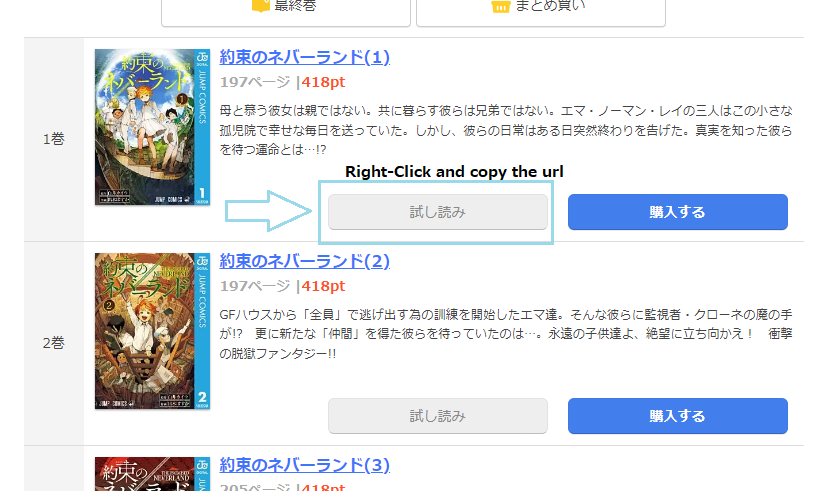

# K-Manga-downloader
Download manga from [K-Manga](https://comic.k-manga.jp/)

## Basic Usage
1. Download [release](https://github.com/Elastic1/kmanga-downloader/releases)
2. Right-click the button and copy the URL of the book.

3. Run `./kmanga.exe --url [url]`

## Options

Examples:  
```
./kmanga.exe --config config.json --url [url]
``` 
```
./kmanga.exe --mail user@example.com --password mypassword --url [url]
``` 

#### `-h, --help`  
Display help message
#### `--mail`
Account mail
#### `--password`
Account password
#### `--out`
Output directory (default: manga)
#### `--config`
Path of config file. You can set the cli options in config file. 
#### `--url`
Dowload manga url


